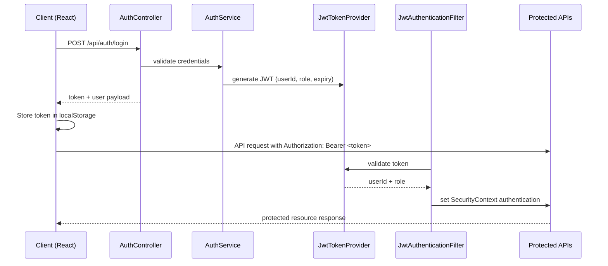
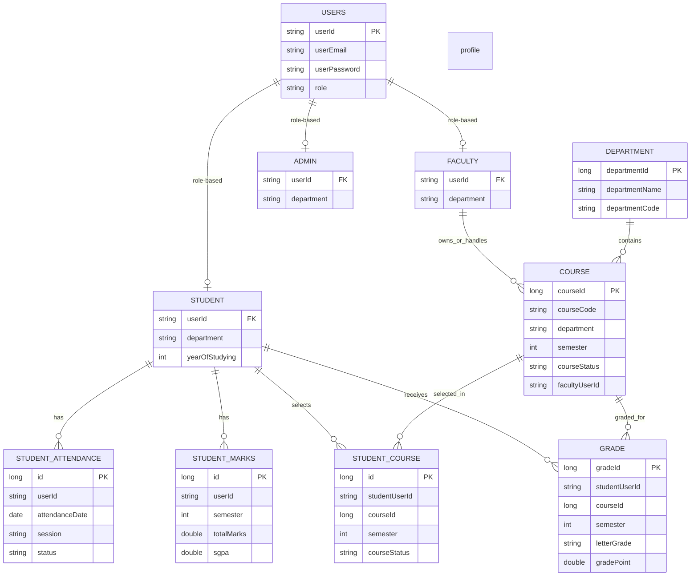
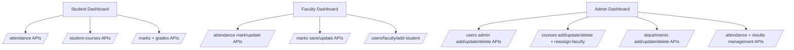

# APVD Project Architecture Diagram

This diagram is generated from the current source code in both projects:
- `APVD_F/APVD` (React + Vite frontend)
- `APVD_B/apvd` (Spring Boot backend)

## 1) System Component Architecture

```mermaid
flowchart LR
    U[User Browser]

    subgraph FE[Frontend - React + Vite (APVD_F/APVD)]
      APP[App.jsx Router]
      NAV[Navigation + ProtectedRoute]
      AUTHCTX[AuthContext]
      THEME[ThemeContext]
      PAGES[Pages: Home/Login/Register\nStudent/Faculty/Admin Dashboards]
      APIJS[services/api.js\nAxios + JWT interceptors]
    end

    subgraph BE[Backend - Spring Boot (APVD_B/apvd)]
      SEC[Security Layer\nSecurityConfig + JwtAuthenticationFilter\nJwtTokenProvider]
      CTRL[Controllers\nAuth/User/Course/Department\nStudentCourse/Attendance/Marks/Grade]
      SVC[Services\nAuth/User/Course/Department\nStudentCourse/Attendance/Marks/Grade]
      REPO[Repositories (Spring Data JPA)]
      EXH[GlobalExceptionHandler]
    end

    DB[(MySQL\napvd_db)]

    U --> FE
    APP --> NAV
    APP --> PAGES
    NAV --> AUTHCTX
    APP --> THEME
    PAGES --> APIJS
    AUTHCTX --> APIJS

    APIJS -->|HTTP REST + Bearer JWT| SEC
    SEC --> CTRL
    CTRL --> SVC
    CTRL --> EXH
    SVC --> REPO
    REPO --> DB
```

## 2) Authentication & Authorization Flow



## 3) Core Domain Model (Logical)



## 4) Role-based UI to API Mapping



## Notes
- Frontend routing and role guards are in `src/App.jsx` and `src/components/ProtectedRoute.jsx`.
- JWT is attached by Axios interceptor in `src/services/api.js`.
- Backend security is enforced via `SecurityConfig` + `JwtAuthenticationFilter`.
- Runtime business errors are normalized by `GlobalExceptionHandler`.
